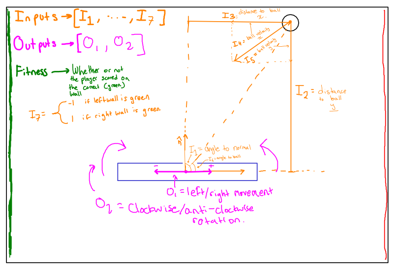
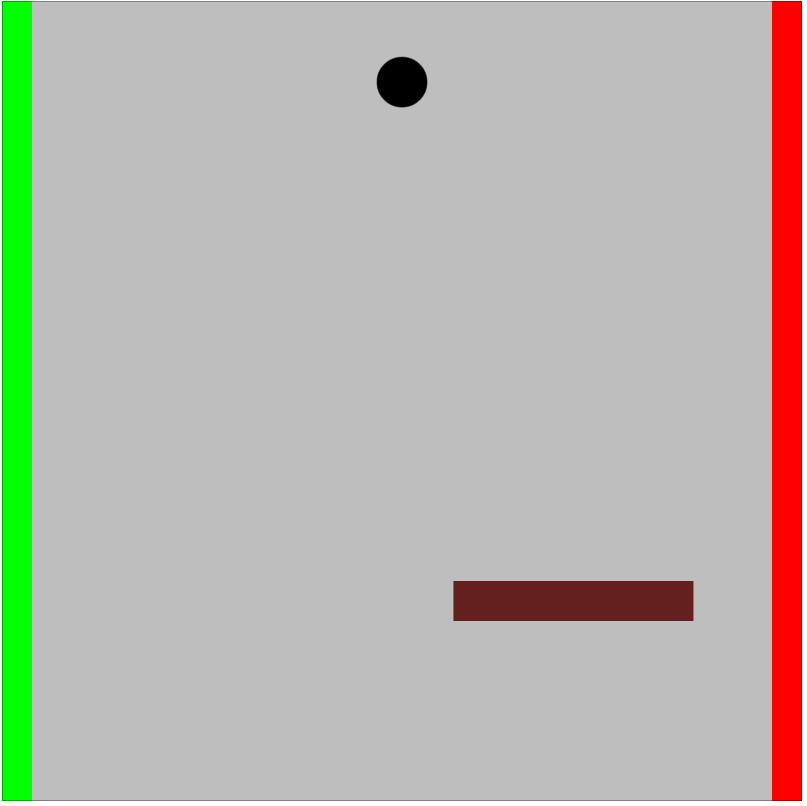
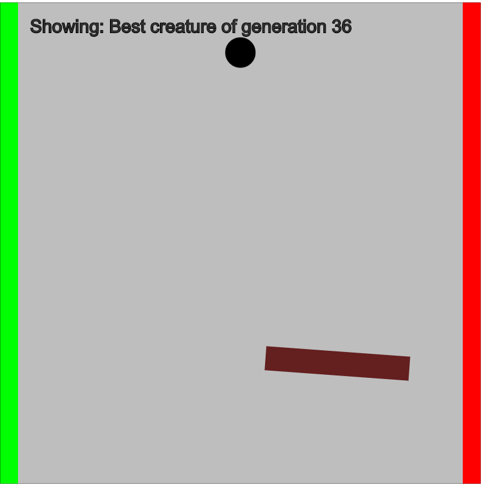

# Balancer-AI
Training an AI to bounce a ball to a given goal. The AI would need to rotate and move its body to change the trajectory of the ball to the desired trajectory.

## Basic inputs and outputs for the neural network controller:

## How the creature can gain (:smile:) or lose (:frowning_face:) fitness

### Results
This is the result after a few generations of training. Some of them have inverted brains and score on the RED side, but most of them learn to bounce the ball on the green wall, scoring repeatedly:

##### Here's another example of some interesting behaviour:
This one stays in place until the ball comes in short so it moves to the left to catch it.

